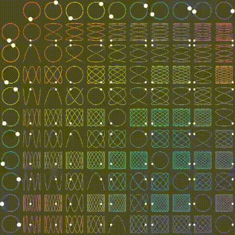

# Draw circles and squiggles

2D animation of patterns drawn by combining two sets of inputs.

[](https://travis-ci.com/mlgx/draw-circles-and-squiggles)

Implementation of this gif I found online.



```go
$ go install github.com/mlgx/draw-circles-and-squiggles
$ draw-circles-and-squiggles 800 10
```
